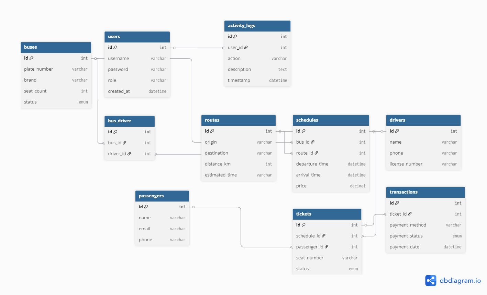

# ⚡🚌 Bus Management System - Command & Control ⚡🚌

<div align="center">
  
  
  [](https://php.net)
  [](https://mysql.com)
  [](https://getbootstrap.com)
  [](https://sttbontang.ac.id)
  
  **⚡ Enterprise-Grade Bus Operations Management System ⚡**
  
  *Professional transport management solution with real-time control and monitoring*
</div>

---

## 🎯 **Developer Profile** 🎯

<div align="center">
  <table>
    <tr>
      <td align="center">👨‍💻</td>
      <td><strong>Nama</strong></td>
      <td>Muhammad Ammar Al Farabi</td>
    </tr>
    <tr>
      <td align="center">🎓</td>
      <td><strong>NIM</strong></td>
      <td>202312056</td>
    </tr>
    <tr>
      <td align="center">✉️</td>
      <td><strong>Email</strong></td>
      <td>alfarabibravo8@gmail.com</td>
    </tr>
    <tr>
      <td align="center">🏫</td>
      <td><strong>Program Studi</strong></td>
      <td>Teknik Informatika</td>
    </tr>
    <tr>
      <td align="center">🏛️</td>
      <td><strong>Institusi</strong></td>
      <td>Sekolah Tinggi Teknologi Bontang</td>
    </tr>
    <tr>
      <td align="center">📚</td>
      <td><strong>Proyek</strong></td>
      <td>Ujian Akhir Semester - Pemrograman Web</td>
    </tr>
  </table>
</div>

---

## 🌐 **Demo & Live Preview**

<div align="center">
  <table>
    <tr>
      <td align="center">
        <a href="#" target="_blank">
          <br/>
          <b>🎥 Video Demo</b><br/>
          <sub>YouTube Presentation</sub>
        </a>
      </td>
      <td align="center">
        <a href="#" target="_blank">
          <br/>
          <b>🌍 Live Demo</b><br/>
          <sub>Hosted Application</sub>
        </a>
      </td>
    </tr>
    <tr>
      <td align="center">
        <a href="#" target="_blank">
          
        </a>
      </td>
      <td align="center">
        <a href="#" target="_blank">
          
        </a>
      </td>
    </tr>
  </table>
</div>

> 📝 **Note:** Replace `#` links above with actual YouTube and hosting URLs

### 🎬 **Video Demonstration**
- **YouTube Link:** [Click here to watch application demo](#) 
- **Duration:** ~15-20 minutes
- **Content:** Feature walkthrough, code overview, and system architecture

### 🌍 **Live Application**
- **Hosting URL:** https://x-clay.mangaverse.my.id/(#)
- **Test Accounts:** Use demo accounts provided below
- **Status:** ✅ Online 24/7

---

## 📚 **Complete Documentation**

For detailed information about this project, please visit the complete documentation:

<div align="center">
  <table>
    <tr>
      <td align="center">
        <a href="docs/DATABASE.md">
          <br/>
          <b>🗄️ Database</b><br/>
          <sub>Schema & Structure</sub>
        </a>
      </td>
      <td align="center">
        <a href="docs/INSTALLATION.md">
          <br/>
          <b>🔧 Installation</b><br/>
          <sub>Setup Guide</sub>
        </a>
      </td>
      <td align="center">
        <a href="docs/DEPLOYMENT.md">
          <br/>
          <b>🚀 Deployment</b><br/>
          <sub>Production Guide</sub>
        </a>
      </td>
      <td align="center">
        <a href="docs/USAGE.md">
          <br/>
          <b>📖 Usage</b><br/>
          <sub>User Manual</sub>
        </a>
      </td>
    </tr>
  </table>
</div>

### 📋 **Quick Navigation**
- [👨‍💻 Developer Profile](#-developer-profile-) | [🎬 Demo & Preview](#-demo--live-preview) | [⚡ Features](#-core-features) | [🏗️ Architecture](#️-system-architecture)
- [📁 Structure](#-project-structure) | [🚀 Installation](#-quick-start) | [🎮 Usage](#-usage-guide) | [🔐 Security](#-security-features)
- [🎨 Design](#-design-system) | [🐛 Troubleshooting](#-troubleshooting) | [📞 Support](#-support--contact) | [📄 License](#-license)

---

## ⚡ **Core Features**

### 🎯 **Administrative Command Center**
- **🚁 Real-time Dashboard** - Complete system overview with live metrics
- **🛡️ User Management** - Full control over user accounts and permissions
- **🚌 Fleet Management** - Comprehensive bus fleet tracking and maintenance
- **🗺️ Route Control** - Dynamic route management and optimization
- **📅 Schedule Coordination** - Advanced scheduling with conflict detection
- **💰 Transaction Monitoring** - Real-time payment and booking analytics
- **📊 Intelligence Reports** - Data-driven insights and operational reports
- **🔍 Activity Surveillance** - Complete user activity tracking and logs

### 👤 **User Operations Center**
- **🔐 Secure Authentication** - Military-grade login and registration system
- **📋 Schedule Intel** - Real-time bus schedule and availability data
- **🎫 Tactical Booking** - Strategic seat selection and reservation system
- **📚 Mission History** - Complete booking and travel history tracking
- **🖨️ Digital Tickets** - Professional e-ticket generation and printing
- **⚙️ Profile Command** - Personal account management and customization

---

## 🏗️ **System Architecture**

### **Tech Stack**
- **Backend**: PHP 7.4+ with native PDO
- **Database**: MySQL 5.7+ with optimized queries
- **Frontend**: Bootstrap 4.5, HTML5, CSS3, JavaScript ES6+
- **Authentication**: Session-based with secure password hashing
- **Security**: SQL injection prevention, XSS protection, CSRF tokens
- **Icons**: Font Awesome 5.15 & custom icon set

### **Database Architecture**

<div align="center">
  
  <p><em>🎯 Entity Relationship Diagram - Bus Management System</em></p>
  <p><sub>Click <a href="docs/DATABASE.md">here</a> for complete database documentation</sub></p>
</div>

```
📊 Database: bus_management
├── users (👥 System users & administrators)
├── routes (🗺️ Travel routes and destinations)
├── buses (🚌 Fleet management and specifications)
├── schedules (📅 Departure schedules and timing)
├── passengers (👤 Passenger information)
├── tickets (🎫 Booking and ticket management)
├── transactions (💰 Payment and financial records)
└── activity_logs (📋 System activity tracking)
```

---

## 📁 **Project Structure**

```
UAS_PWEB/
├── 📁 admin/                         # 🎯 Administrative Command Center
│   ├── dashboard.php                 # 📊 Main admin dashboard
│   ├── add_bus.php                   # ➕ Add new bus to fleet
│   ├── add_driver.php                # 👨‍✈️ Driver registration
│   ├── add_route.php                 # 🗺️ Route creation
│   ├── add_schedule.php              # 📅 Schedule management
│   ├── add_user.php                  # 👤 User account creation
│   ├── edit_*.php                    # ✏️ Edit operations
│   ├── manage_buses.php              # 🚌 Fleet management
│   ├── manage_drivers.php            # 👨‍✈️ Driver management
│   ├── manage_routes.php             # 🗺️ Route administration
│   ├── manage_schedules.php          # 📅 Schedule coordination
│   ├── manage_transactions.php       # 💰 Financial oversight
│   ├── manage_users.php              # 👥 User administration
│   ├── reports.php                   # 📊 Analytics and reports
│   └── user_activity.php             # 🔍 Activity monitoring
├── 🔧 config/                        # ⚙️ System configuration
│   └── database.php                  # 🗄️ Database connection
├── 📎 includes/                       # 🔧 Core components
│   ├── admin_sidebar.php             # 🎛️ Admin navigation
│   ├── auth.php                      # 🔐 Authentication system
│   ├── footer.php                    # 🦶 Footer template
│   └── header.php                    # 🎩 Header template
├── 🗄️ database/                       # 📊 Database schema
│   └── bus_management.sql            # 🗃️ Database dump
├── 📚 docs/                          # 📖 Complete documentation
│   ├── DATABASE.md                   # 🗄️ Database documentation
│   ├── DEPLOYMENT.md                 # 🚀 Deployment guide
│   ├── erd_diagram.png               # 📊 ERD diagram image
│   ├── INSTALLATION.md               # 🔧 Installation guide
│   └── USAGE.md                      # 📖 Usage manual
├── .php-preview-router.php            # 🔄 PHP preview router
├── booking.php                        # 🎫 Ticket booking system
├── booking_confirmation.php           # ✅ Booking confirmation
├── bus_management.sql                 # 🗄️ Database schema (root)
├── check_bookings.php                 # 🔍 Booking verification
├── convert_passwords_to_plaintext.php # 🔧 Password utility
├── index.php                          # 🏠 Main homepage
├── index_old.php                      # 📜 Legacy homepage
├── login.php                          # 🔐 User authentication
├── logout.php                         # 🚪 Session termination
├── my_bookings.php                    # 📚 User booking history
├── print_ticket.php                   # 🖨️ Ticket printing
├── profile.php                        # ⚙️ User profile management
├── README.md                          # 📄 Project documentation
├── schedules.php                      # 📅 Schedule display
├── test_data.php                      # 🧪 Test data generator
├── test_login_plaintext.php           # 🔬 Login testing
└── update_existing_bookings.php       # 🔄 Booking updates
```

---

## 🚀 **Quick Start**

### ⚡ **Lightning Setup**

```bash
# 1. Environment Preparation
git clone <repository-url> UAS_PWEB
cd UAS_PWEB

# 2. XAMPP Configuration
# Start Apache + MySQL services

# 3. Database Deployment
# Import database/bus_management.sql via phpMyAdmin

# 4. Access Mission Control
http://localhost/UAS_PWEB
```

### 🔐 **Command Access Codes**

<div align="center">
  <table>
    <tr>
      <th>🎯 Administrator</th>
      <th>👤 Standard User</th>
    </tr>
    <tr>
      <td>
        <b>Username:</b> <code>admin</code><br/>
        <b>Password:</b> <code>admin123</code><br/>
        <b>Access Level:</b> Full Command
      </td>
      <td>
        <b>Username:</b> <code>user</code><br/>
        <b>Password:</b> <code>user123</code><br/>
        <b>Access Level:</b> Standard Operations
      </td>
    </tr>
  </table>
</div>

> ⚠️ **Security Protocol:** Change default passwords immediately after deployment

---

## 🎮 **Usage Guide**

### 🎯 **Administrator Operations**
1. **System Overview** - Access real-time dashboard metrics
2. **Fleet Command** - Manage bus fleet and driver assignments
3. **Route Planning** - Create and optimize travel routes
4. **Schedule Control** - Coordinate departure and arrival times
5. **Financial Oversight** - Monitor transactions and revenue
6. **Intelligence Reports** - Generate operational analytics
7. **Security Monitoring** - Track user activities and system logs

### 👤 **User Operations**
1. **Mission Planning** - Browse available schedules and routes
2. **Tactical Booking** - Reserve seats and generate tickets
3. **Status Tracking** - Monitor booking status and history
4. **Profile Management** - Update personal information and preferences
5. **Digital Assets** - Download and print e-tickets

---

## 🔐 **Security Features**

### 🛡️ **Defense Systems**
- ✅ **SQL Injection Shield** - Prepared statements and input sanitization
- ✅ **XSS Protection** - Output encoding and content filtering
- ✅ **CSRF Defense** - Token-based request validation
- ✅ **Session Armor** - Secure session management
- ✅ **Password Fortress** - BCrypt hashing with salt
- ✅ **Access Control** - Role-based permission system
- ✅ **Activity Intelligence** - Comprehensive audit logging

---

## 🎨 **Design System**

### 🎯 **Color Scheme**
- **Primary**: `#2c3e50` (Midnight Blue)
- **Secondary**: `#34495e` (Dark Gray)
- **Accent**: `#27ae60` (Emerald)
- **Warning**: `#f39c12` (Orange)
- **Danger**: `#e74c3c` (Red)

### 💎 **Typography**
- **Font Family**: 'Roboto', 'Arial', sans-serif
- **Headers**: Bold, uppercase for impact
- **Body**: Clean, readable, professional

---

## 🚌 **System Overview**

Bus Sekian Jaya Management System adalah aplikasi web berbasis PHP yang dirancang untuk mempermudah pengelolaan transportasi bus. Sistem ini menyediakan platform lengkap untuk admin dan pengguna dalam mengelola jadwal perjalanan, pemesanan tiket, dan operasional bus.

## ✨ Fitur Utama

### 👤 Untuk Pengguna (User)

- **Registrasi & Login**: Sistem autentikasi pengguna
- **Lihat Jadwal**: Melihat jadwal keberangkatan bus yang tersedia
- **Pemesanan Tiket**: Booking tiket dengan pemilihan kursi
- **Riwayat Pemesanan**: Melihat history booking dan status pembayaran
- **Cetak Tiket**: Download/print tiket elektronik
- **Profil**: Manage profil dan update informasi

### 🛠️ Untuk Administrator

- **Dashboard Admin**: Overview sistem dan statistik
- **Manajemen User**: Kelola akun pengguna
- **Manajemen Bus**: CRUD data bus dan armada
- **Manajemen Rute**: Kelola rute perjalanan
- **Manajemen Jadwal**: Buat dan kelola jadwal keberangkatan
- **Manajemen Transaksi**: Monitor pembayaran dan transaksi
- **Laporan**: Generate berbagai laporan operasional
- **Activity Logs**: Tracking aktivitas user

## 🏗️ Teknologi yang Digunakan

- **Backend**: PHP 7.4+
- **Database**: MySQL 5.7+
- **Frontend**: HTML5, CSS3, JavaScript
- **Framework CSS**: Bootstrap 4.5
- **Icons**: Font Awesome 5.15
- **Server**: Apache (XAMPP)

## 📁 Struktur Proyek

```
UAS_PWEB/
├── admin/                  # Panel administrasi
│   ├── dashboard.php
│   ├── manage_*.php       # CRUD modules
│   └── add_*.php         # Form tambah data
├── config/               # Konfigurasi
│   └── database.php      # Koneksi database
├── includes/             # File include
│   ├── auth.php         # Sistem autentikasi
│   ├── header.php       # Header template
│   └── footer.php       # Footer template
├── docs/                # Dokumentasi
│   ├── INSTALLATION.md  # Panduan instalasi
│   ├── DATABASE.md      # Dokumentasi database
│   └── USAGE.md        # Panduan penggunaan
├── assets/             # Asset statis (jika ada)
├── index.php           # Halaman utama
├── login.php           # Halaman login
├── schedules.php       # Daftar jadwal
├── booking.php         # Pemesanan tiket
├── my_bookings.php     # Riwayat booking
└── profile.php         # Profil pengguna
```

## 🚀 Quick Start

1. **Clone/Download** proyek ini
2. **Setup** XAMPP dan jalankan Apache + MySQL
3. **Import** database dari `database/bus_management.sql`
4. **Konfigurasi** database di `config/database.php`
5. **Akses** aplikasi melalui `http://localhost/UAS_PWEB`

## 📚 Dokumentasi Lengkap

- 📖 [Panduan Instalasi](docs/INSTALLATION.md)
- 🗄️ [Dokumentasi Database](docs/DATABASE.md)
- 📝 [Panduan Penggunaan](docs/USAGE.md)

## 👥 Default Akun

### Administrator

- **Username**: `admin`
- **Password**: `admin123`

### User Demo

- **Username**: `user`
- **Password**: `user123`

## 🔧 Persyaratan Sistem

- **PHP**: 7.4 atau lebih tinggi
- **MySQL**: 5.7 atau lebih tinggi
- **Apache**: 2.4+
- **Browser**: Chrome, Firefox, Safari, Edge (modern browsers)
- **Memory**: Minimal 512MB RAM
- **Storage**: Minimal 100MB disk space

## 📄 Lisensi

Proyek ini dibuat untuk keperluan akademis (UAS Pemrograman Web).

## 👨‍💻 Pengembang

Dikembangkan sebagai proyek Ujian Akhir Semester mata kuliah Pemrograman Web.

---

**⚡ Quick Links:**

- [🚀 Instalasi](docs/INSTALLATION.md)
- [📊 Database](docs/DATABASE.md)
- [📖 Penggunaan](docs/USAGE.md)
- [🐛 Issues](https://github.com/username/repo/issues)

**© 2025 M. Ammar Alfarabi - STITEK Bontang 🌟**
